# StudyGoup

## 2020.4.5

### 1、Springboot项目部署阿里云，Vue打包App

在王道的时候学习了在linux安装常用开发软件。这里不再写安装过程。

1）、首先再阿里云服务器上安装mysql，tomcat，jdk，redis等，然后让软件跑起来。


2）、然后将数据库表用navicat连接阿里云服务器，然后将数据库表导入到阿里云mysql中：

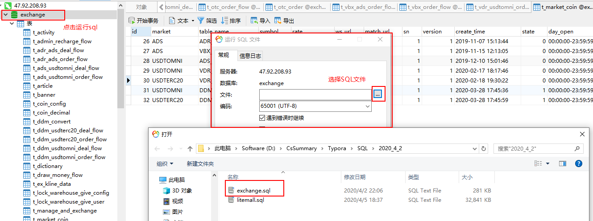

3.修改Springboot项目中 application.yml 中的 数据库配置，redis配置，influxdb配置

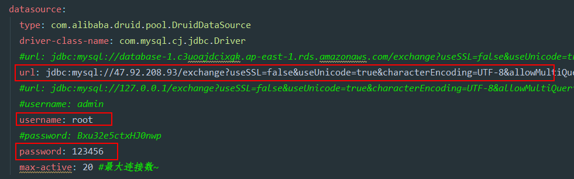

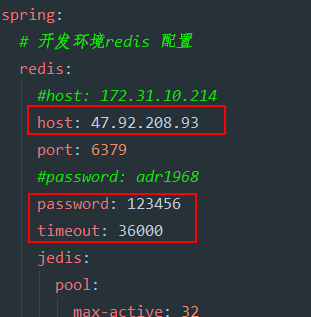

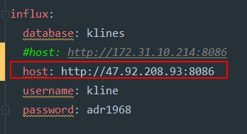

3）、用IDEA打包 先点击Maven中的clean，然后点击install

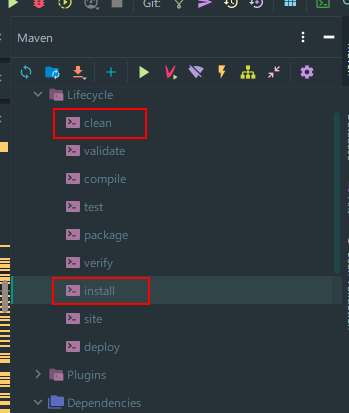

打包完了以后 会在target文件夹下生产.jar文件

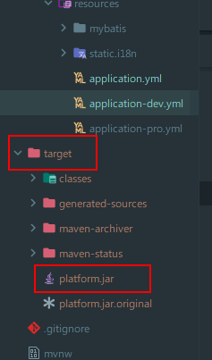

然后利用FTP工具，将jar包发送到阿里云服务器上（最好发之前，在电脑上cmd里面运行一下这个jar包是否没问题）

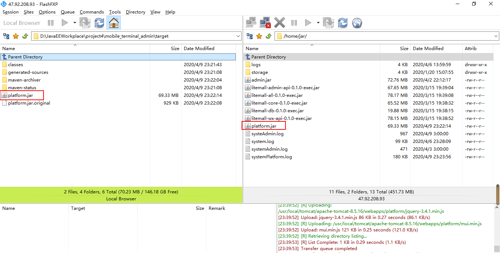

4）、让.jar文件永久运行在阿里云服务器上：

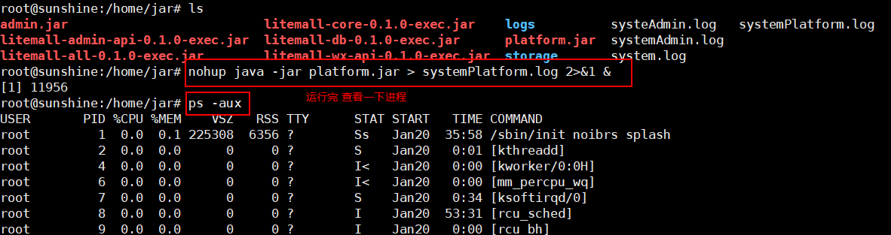

```shell
nohup java -jar blog.jar > system.log 2>&1 &
```

5）、开放阿里云安全组（软件的安全组也要开启，比如mysql，redis，influxdb等  这里打码啦）

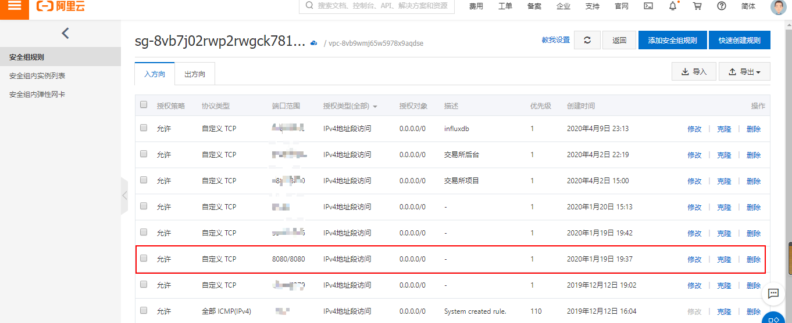

6）、然后用电脑的前端连接服务器测试

### 2、解决Ubuntu18设置mysql的sql_mode导致的数据库数据导入不到服务器的问题

由于要往阿里云服务器导入数据，结果有一个表始终导入不进去，网上找各种解决方案，都是修改sql_mode,但是网上好多解决方案好多不是Ubuntu，可能是CentOS的，文件夹目录不一样，这个问题搞了两天才解决。


**原因：**

MySQL 5.7.5及以上功能依赖检测功能。如果启用了ONLY_FULL_GROUP_BY SQL模式（默认情况下），MySQL将拒绝选择列表，HAVING条件或ORDER BY列表的查询引用在GROUP BY子句中既未命名的非集合列，也不在功能上依赖于它们。

（5.7.5之前，MySQL没有检测到功能依赖关系，默认情况下不启用ONLY_FULL_GROUP_BY。有关5.7.5之前的行为的说明，请参见“MySQL 5.6参考手册”。）

**一.临时性解决**

终端执行 set @@global.sql_mode = ‘STRICT_TRANS_TABLES,NO_ZERO_IN_DATE,NO_ZERO_DATE,ERROR_FOR_DIVISION_BY_ZERO,NO_AUTO_CREATE_USER,NO_ENGINE_SUBSTITUTION’;

如果 NO_AUTO_CREATE_USER 报错，去掉它重新执行。

set @@global.sql_mode = ‘STRICT_TRANS_TABLES,ERROR_FOR_DIVISION_BY_ZERO,NO_ENGINE_SUBSTITUTION’;

注：该方法在MySQL重启后就会失效。

**二.从根本解决**

终端执行 **sudo vim /etc/mysql/conf.d/mysql.cnf**    **文件目录很重要 网上的好多那个目录改了不起作用，这个值Ubuntu的没错。**

粘贴以下文本：

[mysqld] 
**sql_mode=STRICT_TRANS_TABLES,ERROR_FOR_DIVISION_BY_ZERO,NO_AUTO_CREATE_USER,NO_ENGINE_SUBSTITUTION**

保存退出

**重启mysql服务 sudo service mysql restart**

如果重启失败，去掉NO_AUTO_CREATE_USER，保存退出重新启动


## 2020.4.9

### 1.influxdb 安装使用 部署 修改用户名 结合SpringBoot项目

前面这部分是网上的资源 ：https://blog.csdn.net/llwy1428/article/details/85331753 

测试有效 所以保存。


用在哪里？

我们公司做交易所项目，这个数据库用在存储交易信息，然后页面显示k线图

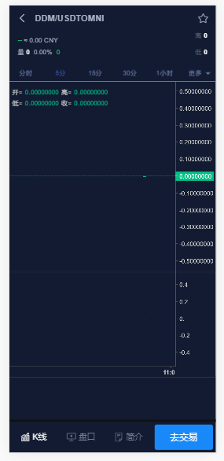

听16期渝淮老哥说，他们万维是用这个做系统功能监控的。


influxdb是目前比较流行的**时间序列数据库**

- 何谓时间序列数据库？
  什么是时间序列数据库，最简单的定义就是数据格式里包含Timestamp字段的数据，比如某一时间环境的温度，CPU的使用率等。但是，有什么数据不包含Timestamp呢？几乎所有的数据其实都可以打上一个Timestamp字段。时间序列数据的更重要的一个属性是如何去查询它，包括数据的过滤，计算等等。

Influxdb

Influxdb是一个开源的分布式时序、时间和指标数据库，使用go语言编写，无需外部依赖。
它有三大特性：

1. 时序性（Time Series）：与时间相关的函数的灵活使用（诸如最大、最小、求和等）；
2. 度量（Metrics）：对实时大量数据进行计算；
3. 事件（Event）：支持任意的事件数据，换句话说，任意事件的数据我们都可以做操作。

同时，它有以下几大特点：

- schemaless(无结构)，可以是任意数量的列；
- min, max, sum, count, mean, median 一系列函数，方便统计；
- Native HTTP API, 内置http支持，使用http读写；
- Powerful Query Language 类似sql；
- Built-in Explorer 自带管理工具。

### Influxdb安装

------

> 注：本文使用的influxdb version是1.0.2

在讲解具体的安装步骤之前，先说说influxdb的两个http端口：8083和8086

- port 8083：管理页面端口，访问localhost:8083可以进入你本机的influxdb管理页面；
- port 8086：http连接influxdb client端口，一般使用该端口往本机的influxdb读写数据。
- 

Docker Image

```shell
docker pull influxdb
```

Ubuntu & Debian

```shell
wget https://dl.influxdata.com/influxdb/releases/influxdb_1.0.2_amd64.debsudo dpkg -i influxdb_1.0.2_amd64.deb
```

**How to start？**
**安装完之后，如何启动呢？**

```shell
sudo service influxdb start
```

到这里influxdb安装启动完成，可以访问influxdb管理页面：[本地管理页面](http://localhost:8083/)，该版本没有登录用户及密码，可以自行设置读写的用户名和密码。

如何在命令行使用
安装完毕之后，如何在命令行使用呢？

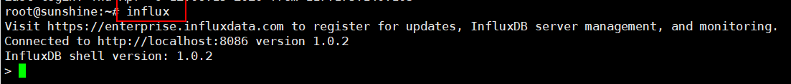

influxdb在命令行中使用

### influxdb基本操作

------

名词解释

在具体的讲解influxdb的相关操作之前先说说influxdb的一些专有名词，这些名词代表什么。

influxdb相关名词

- database：数据库；
- measurement：数据库中的表；（这里要注意，插入数据的时候 数据库中表也一起插入）
- points：表里面的一行数据。

influxDB中独有的一些概念

Point由时间戳（time）、数据（field）和标签（tags）组成。

- time：每条数据记录的时间，也是数据库自动生成的主索引；
- fields：各种记录的值；
- tags：各种有索引的属性。

还有一个重要的名词：series
所有在数据库中的数据，都需要通过图表来表示，series表示这个表里面的所有的数据可以在图标上画成几条线（注：线条的个数由tags排列组合计算出来）
举个简单的小栗子：
有如下数据：

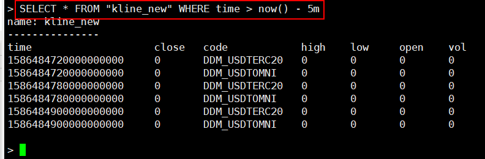


influxdb基本操作

- 数据库与表的操作
  可以直接在web管理页面做操作，当然也可以命令行。

  ```sql
  #创建数据库
  create database "db_name"
  
  #显示所有的数据库
  show databases
  
  #删除数据库
  drop database "db_name"
  
  #使用数据库
  use db_name
  
  #显示该数据库中所有的表show measurements
  
  #创建表，直接在插入数据的时候指定表名
  insert test,host=127.0.0.1,monitor_name=test count=1
  
  #删除表
  drop measurement "measurement_name"
  ```

- 增
  向数据库中插入数据。

  - 通过命令行

    ```sql
    use testDb
    insert test,host=127.0.0.1,monitor_name=test count=1
    ```

  - 通过http接口

    ```sql
    curl -i -XPOST 'http://127.0.0.1:8086/write?db=testDb' --data-binary 'test,host=127.0.0.1,monitor_name=test count=1'
    ```

  

  读者看到这里可能会观察到插入的数据的格式貌似比较奇怪，这是因为influxDB存储数据采用的是Line Protocol格式。那么何谓Line Protoco格式？

  Line Protocol格式：写入数据库的Point的固定格式。
  在上面的两种插入数据的方法中都有这样的一部分：

  ```sql
  test,host=127.0.0.1,monitor_name=test count=1
  ```

  其中：

  1. test：表名；
  2. host=127.0.0.1,monitor_name=test：tag；
  3. count=1：field

  想对此格式有详细的了解参见[官方文档](https://docs.influxdata.com/influxdb/v0.10/write_protocols/line/)

- 查
  查询数据库中的数据。

  - 通过命令行

    ```sql
    select * from test order by time desc
    ```

  - 通过http接口

    ```sql
    curl -G 'http://localhost:8086/query?pretty=true' --data-urlencode "db=testDb" --data-urlencode "q=select * from test order by time desc"
    ```

  influxDB是支持类sql语句的，具体的查询语法都差不多，这里就不再做详细的赘述了。

  

- 连续查询（Continous Queries）

  当数据超过保存策略里指定的时间之后就会被删除，但是这时候可能并不想数据被完全删掉，怎么办？

  influxdb提供了联系查询，可以做数据统计采样。

  - 查看数据库的Continous Queries

    ```
    show continuous queries
    ```

    

    continuous_queries.

  - 创建新的Continous Queries

    ```sql
    create continous query cq_name on db_name begin select sum(count) into new_table_name from table_name group by time(30m) end
    ```

    - cq_name：连续查询名字；
    - db_name：数据库名字；
    - sum(count)：计算总和；
    - table_name：当前表名；
    - new_table_name：存新的数据的表名；
    - 30m：时间间隔为30分钟

  - 删除Continous Queries

    ```sql
    drop continous query cp_name on db_name
    ```

- 用户管理

  可以直接在web管理页面做操作，也可以命令行。

  ```sql
  #显示用户 
  show users#
  
  创建用户
  create user "username" with password 'password'
  
  #创建管理员权限用户
  create user "username" with password 'password' with all privileges
  
  #删除用户
  drop user "username"
  ```


**结合SpringBoot项目**

首先导入依赖：

```xml
<dependency>
    <groupId>org.influxdb</groupId>
    <artifactId>influxdb-java</artifactId>
    <version>2.12</version>
</dependency>
```

然后再application.yml 中添加配置信息

```yml
influx:
  database: klines
  #host: http://172.31.10.214:8086
  host: http://47.92.208.93:8086
  username: kline
  password: adr1968
```

然后就可以在项目中使用啦。


**注意：**

如果在wins启动这个influxdb的时候，需要在先启动下面的influxd.exe,然后启动上面的influx.exe

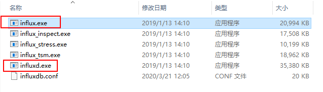

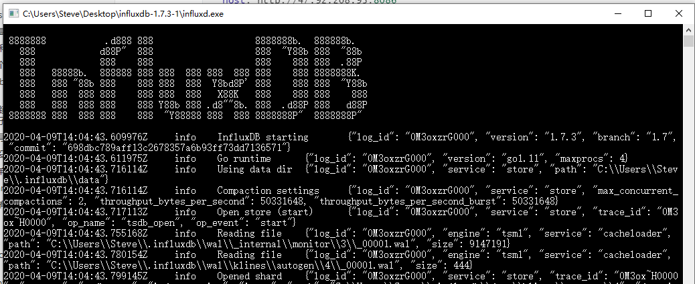

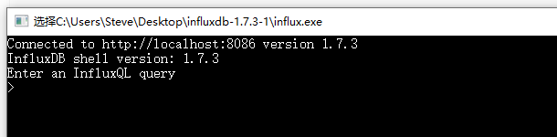


当然啦，还有和redis一样的可视化工具，influxDB Studio

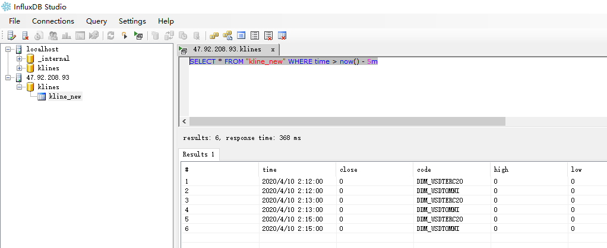

### 2.定时器@Scheduled(cron = "0 0/1 * * * ?") 

有的地方也叫 cron表达式

项目中遇到，所以研究了一下

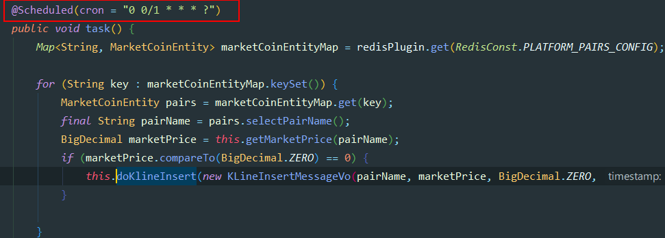


**一些栗子：**

CRON表达式                    含义 
"0 0 12 * * ?"                   每天中午十二点触发 
"0 15 10 ? * *"                 每天早上10：15触发 
"0 15 10 * * ?"                 每天早上10：15触发 
"0 15 10 * * ? *"              每天早上10：15触发 
"0 15 10 * * ? 2005"       2005年的每天早上10：15触发 
"0 * 14 * * ?"                   每天从下午2点开始到2点59分每分钟一次触发 
"0 0/5 14 * * ?"                每天从下午2点开始到2：55分结束每5分钟一次触发 
"0 0/5 14,18 * * ?"          每天的下午2点至2：55和6点至6点55分两个时间段内每5分钟一次触发 
"0 0-5 14 * * ?"                每天14:00至14:05每分钟一次触发 
"0 10,44 14 ? 3 WED"      三月的每周三的14：10和14：44触发 
"0 15 10 ? * MON-FRI"    每个周一、周二、周三、周四、周五的10：15触发 


0 0 10,14,16 * * ?             每天上午10点，下午2点，4点
0 0/30 9-17 * * ?              朝九晚五工作时间内每半小时
0 0 12 ? * WED                表示每个星期三中午12点 
"0 0 12 * * ?"                   每天中午12点触发 
"0 15 10 ? * *"                 每天上午10:15触发 
"0 15 10 * * ?"                 每天上午10:15触发 
"0 15 10 * * ? *"              每天上午10:15触发 
"0 15 10 * * ? 2005"        2005年的每天上午10:15触发 
"0 * 14 * * ?"                    在每天下午2点到下午2:59期间的每1分钟触发 
"0 0/5 14 * * ?"                在每天下午2点到下午2:55期间的每5分钟触发 
"0 0/5 14,18 * * ?" 		  在每天下午2点到2:55期间和下午6点到6:55期间的每5分钟触发 
"0 0-5 14 * * ?"                 在每天下午2点到下午2:05期间的每1分钟触发 
"0 10,44 14 ? 3 WED"       每年三月的星期三的下午2:10和2:44触发 
"0 15 10 ? * MON-FRI"     周一至周五的上午10:15触发 
"0 15 10 15 * ?"                 每月15日上午10:15触发 
"0 15 10 L * ?"                   每月最后一日的上午10:15触发 
"0 15 10 ? * 6L"                 每月的最后一个星期五上午10:15触发 
"0 15 10 ? * 6L 2002-2005" 2002年至2005年的每月的最后一个星期五上午10:15触发 
"0 15 10 ? * 6#3"               每月的第三个星期五上午10:15触发 


**从前到后 依次的顺序为：**

1.秒（0~59）

2.分钟（0~59）

3.小时（0~23）

4.天（月）（0~31，但是你需要考虑你月的天数）

5.月（0~11）

6.天（星期）（1~7 1=SUN 或 SUN，MON，TUE，WED，THU，FRI，SAT）

7.年份（1970－2099）


**前面的数字代表各个时间，那么后面的符号代表什么的？**

每一个域都使用数字，但还可以出现如下特殊字符，它们的含义是： 
1)* ：表示匹配该域的任意值，假如在Minutes域使用*, **即表示每分钟都会触发事件**。

（所以项目中“0 0/1 * * * ？”的就表示任何时候，都是每一分钟执行依次）

2) ?：只能用在DayofMonth和DayofWeek两个域。它也匹配域的任意值，但实际不会。因为DayofMonth和 DayofWeek会相互影响。例如想在每月的20日触发调度，不管20日到底是星期几，则只能使用如下写法： 13 13 15 20 * ?, 其中最后一位只能用？，而不能使用*，如果使用*表示不管星期几都会触发，实际上并不是这样。 

3) -：表示范围，例如在Minutes域使用5-20，表示从5分到20分钟每分钟触发一次 

4) /：表示起始时间开始触发，然后每隔固定时间触发一次，例如在Minutes域使用5/20,则意味着5分钟触发一次，而25，45等分别触发一次. 

5) ,：表示列出枚举值值。例如：在Minutes域使用5,20，则意味着在5和20分每分钟触发一次。 

6) L：表示最后，只能出现在DayofWeek和DayofMonth域，如果在DayofWeek域使用5L,意味着在最后的一个星期四触发。

7) W：表示有效工作日(周一到周五),只能出现在DayofMonth域，系统将在离指定日期的最近的有效工作日触发事件。例如：在 DayofMonth使用5W，如果5日是星期六，则将在最近的工作日：星期五，即4日触发。如果5日是星期天，则在6日(周一)触发；如果5日在星期一 到星期五中的一天，则就在5日触发。另外一点，W的最近寻找不会跨过月份。

8) LW：这两个字符可以连用，表示在某个月最后一个工作日，即最后一个星期五。 

9) #：用于确定每个月第几个星期几，只能出现在DayofMonth域。例如在4#2，表示某月的第二个星期三。


## 2020.4.12

### 1.做了两道LeetCode，斐波那契数列和爬楼梯，都可以用递归做，但是动态规划简单，而且这两个题的初始值f(0),f(1)是不一样的，小细节

青蛙跳台阶问题和斐波那契数列（兔子出生问题）比较：

#### 递归思想：

斐波那契数列：

```java
public static int fibSeq(int n){
    if(n<0){
        throw new IllegalArgumentException("the param is less than 0");
    }
    if(n==0)
        return 0;

    if(n==1)
        return 1;
    return fibSeq(n-1);+fibSeq(n-2);
}

//王道的经典50道java题写法：
private static int fun(int n){
    if(n==1 || n==2)
        return 1;
    else
        return fun(n-1)+fun(n-2);
}

```

爬楼梯：

```
public static int fibSeq(int n){
    if(n<0){
        throw new IllegalArgumentException("the param is less than 0");
    }
    if(n==1)
        return 1;

    if(n==2)
        return 2;
    return fibSeq(n-1);+fibSeq(n-2);
}
```


#### 动态规划思想：

斐波那契数列：

```java
public int fib(int n) { //动态规划做
    int a = 0;
    int b = 1;
    int sum;
    for (int i = 0;i<n;i++) {
        sum = (a + b) % 1000000007;
        a = b;
        b = sum;
    }
    return a; 
}
```

青蛙跳台阶：

```java
public int fib(int n) { //动态规划做
    int a = 1;
    int b = 2;
    int sum;
    for (int i = 0;i<n;i++) {
        sum = (a + b) % 1000000007;
        a = b;
        b = sum;
    }
    return a;
```

上面两个是不同的，主要体现在初始值a，b不同，Leetcode剑指offer上面指出：

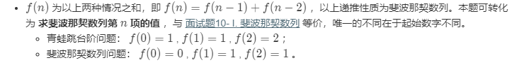

由实际情况可知，青蛙跳台阶，f(1)=1,f(2)=2,才推算出f（0）=1 （个人认为），而题中所写的a，b指的是这个里面的f（0），和f（1）。

斐波那契数列为什么开始是0和1？ 因为斐波那契数列前两项是默认指定的。（个人理解）


补充**动态规划**：

参考（写的非常好）：https://www.cnblogs.com/cthon/p/9251909.html


###  2.redis缓存雪崩和缓存穿透

这一部分，面试老问。今天学习一下。这一部分主要参考JavaGuide上面。人家这个写的很好。

#### **缓存雪崩** 

**什么是缓存雪崩？**

简介：缓存同一时间大面积的失效，所以，后面的请求都会落到数据库上，造成数据库短时间内承受大量请求而崩掉。

**有哪些解决办法？**

（中华石杉老师在他的视频中提到过，视频地址在最后一个问题中有提到）：

- 事前：尽量保证整个 redis 集群的高可用性，发现机器宕机尽快补上。选择合适的内存淘汰策略。
- 事中：本地ehcache缓存 + hystrix限流&降级，避免MySQL崩掉
- 事后：利用 redis 持久化机制保存的数据尽快恢复缓存

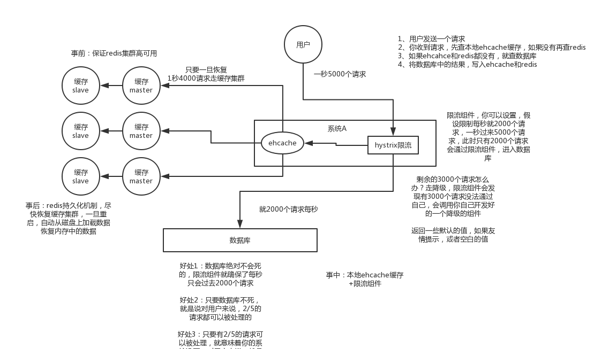

#### **缓存穿透** 

**什么是缓存穿透？**

缓存穿透说简单点就是大量请求的 key 根本不存在于缓存中，导致请求直接到了数据库上，根本没有经过缓存这一层。举个例子：某个黑客故意制造我们缓存中不存在的 key 发起大量请求，导致大量请求落到数据库。下面用图片展示一下(这两张图片不是我画的，为了省事直接在网上找的，这里说明一下)：

**正常缓存处理流程：**


**缓存穿透情况处理流程：**


一般MySQL 默认的最大连接数在 150 左右，这个可以通过 `show variables like '%max_connections%'; `命令来查看。最大连接数一个还只是一个指标，cpu，内存，磁盘，网络等无力条件都是其运行指标，这些指标都会限制其并发能力！所以，一般 3000 个并发请求就能打死大部分数据库了。

**有哪些解决办法？**

最基本的就是首先做好参数校验，一些不合法的参数请求直接抛出异常信息返回给客户端。比如查询的数据库 id 不能小于 0、传入的邮箱格式不对的时候直接返回错误消息给客户端等等。

**1）缓存无效 key** : 如果缓存和数据库都查不到某个 key 的数据就写一个到 redis 中去并设置过期时间，具体命令如下：`SET key value EX 10086`。这种方式可以解决请求的 key 变化不频繁的情况，如果黑客恶意攻击，每次构建不同的请求key，会导致 redis 中缓存大量无效的 key 。很明显，这种方案并不能从根本上解决此问题。如果非要用这种方式来解决穿透问题的话，尽量将无效的 key 的过期时间设置短一点比如 1 分钟。

另外，这里多说一嘴，一般情况下我们是这样设计 key 的： `表名:列名:主键名:主键值`。

 如果用 Java 代码展示的话，差不多是下面这样的：

```java
public Object getObjectInclNullById(Integer id) {
    // 从缓存中获取数据
    Object cacheValue = cache.get(id);
    // 缓存为空
    if (cacheValue == null) {
        // 从数据库中获取
        Object storageValue = storage.get(key);
        // 缓存空对象
        cache.set(key, storageValue);
        // 如果存储数据为空，需要设置一个过期时间(300秒)
        if (storageValue == null) {
            // 必须设置过期时间，否则有被攻击的风险
            cache.expire(key, 60 * 5);
        }
        return storageValue;
    }
    return cacheValue;
}
```

**2）布隆过滤器：**布隆过滤器是一个非常神奇的数据结构，通过它我们可以非常方便地判断一个给定数据是否存在与海量数据中。我们需要的就是判断 key 是否合法，有没有感觉布隆过滤器就是我们想要找的那个“人”。具体是这样做的：把所有可能存在的请求的值都存放在布隆过滤器中，当用户请求过来，我会先判断用户发来的请求的值是否存在于布隆过滤器中。不存在的话，直接返回请求参数错误信息给客户端，存在的话才会走下面的流程。总结一下就是下面这张图(这张图片不是我画的，为了省事直接在网上找的)：


更多关于布隆过滤器的内容可以看我的这篇原创：[《不了解布隆过滤器？一文给你整的明明白白！》](https://github.com/Snailclimb/JavaGuide/blob/master/docs/dataStructures-algorithms/data-structure/bloom-filter.md) ，强烈推荐，个人感觉网上应该找不到总结的这么明明白白的文章了。


## 2020.4.16

### 1.SQL索引，索引数据结构B树，B+树性质特点，为什么不用平衡二叉树二叉树要用B+树，索引优化规则，怎么查看索引使用上了没？

#### 首先说什么是索引?

**索引是一种用于快速查询和检索数据的数据结构。常见的索引结构有: B树， B+树和Hash。**

索引的作用就相当于目录的作用。打个比方: 我们在查字典的时候，如果没有目录，那我们就只能一页一页的去找我们需要查的那个字，速度很慢。如果有目录了，我们只需要先去目录里查找字的位置，然后直接翻到那一页就行了。


Mysql底层用的数据结构是B+树和哈希表，不过多数是B+树。说B+树之前先说一下B树。

哈希表只查一个数据的时候还行，查范围就不行啦。

**一个m阶的B树具有如下几个特征：**（B+树的阶数m表示一个节点最多能有m个子节点，也就是每个节点上最多的键值个数）（这里下面的图，m应该表示的是3）

1.根结点至少有两个子女。

2.每个中间节点都至少包含`ceil(m / 2)`个孩子，最多有m个孩子。 （ceil是向上取整，这里是ceil（1.5）= 2）

3.每一个叶子节点都包含k-1个元素，其中 m/2 <= k <= m。 （1.5<=k<=3）

4.所有的叶子结点都位于同一层。

5.每个节点中的元素从小到大排列，节点当中k-1个元素正好是k个孩子包含的元素的值域分划。


#### B+树与B树的区别

- 有k个子结点的结点必然有k个关键码；
- 非叶结点仅具有索引作用，跟记录有关的信息均存放在叶结点中。
- 树的所有叶结点构成一个有序链表，可以按照关键码排序的次序遍历全部记录。

#### 为什么不用平衡二叉树？

因为随着数据量的增多，二叉树的高度会很高，查询就变慢啦。


#### 那为什么要用B+树呢？

以InnoDB为例：

数据是放在主键索引上面，也就是说实际上在每个节点上还会存放所有的数据

使用B树存放数据之后实际是这样子的，会在每个对应的索引列的值上存放上对应的数据

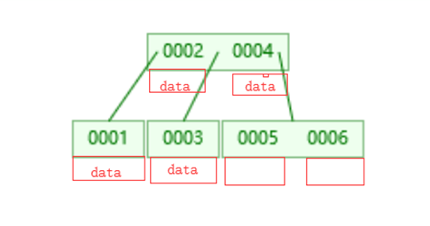

而B+树则不同，它只会在叶子节点上面挂载数据，非叶子节点不会存放数据，数据只会存在叶子节点上面，非叶子节点只存放索引列的数据

 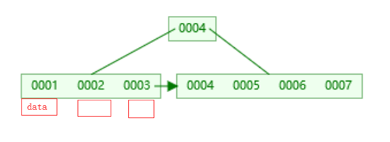

这样一个节点就可以存放很多个索引列数据，一次IO就可以拿到很多数据，mysql默认的一个节点16K的大小，可以通过show global status like "Innodb_page_size" 看到该值是16384，每次IO读取16K大小的数据，以索引列是bigInt类型为例，大小8字节，每一条数据还有一个指向下一层的指针6字节，16384/（8+6）=1170，一个节点就大约可以存1170条数据。

以一个**层高为3的树**为例，叶子节点存放数据之后大小1KB，那么这个树可以存放 1170 *1170 *16 =21,902,400,**大约2200万条数据**。所以在这种千万级的表中通过主键索引查找一条数据，最多3次IO就可以找到一条数据。而很多时候树的根节点基本都是在内存中，所以多数时候只需要2次IO。

叶子节点之间也有双向指针连接，提高区间范围性能，范围查找。

创建索引的时候，可以选择索引数据类型，一个是btree一个是hash，hash查找当然也快，但是当遇到范围查找的时候hash就尴尬了，所以根据实际业务需求来看是用btree还是hash。

参考：https://www.cnblogs.com/nijunyang/p/11406688.html


#### 索引优化规则

王道当时有一个文档：Mysql索引及其优化（王道的文档，有些粗略，没讲模糊查询左右之分）

**1）如果MySQL估计使用索引比全表扫描还慢，则不会使用索引。**

返回数据的比例是重要的指标，比例越低越容易命中索引。记住这个范围值——30%，后面所讲的内容都是建立在返回数据的比例在30%以内的基础上。

**2）前导模糊查询不能命中索引。**

name列创建普通索引：

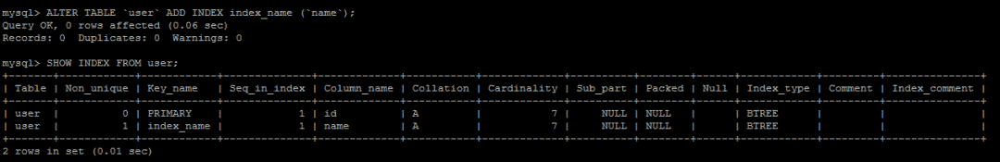

前导模糊查询不能命中索引：

EXPLAIN SELECT * FROM user WHERE name LIKE '%s%';

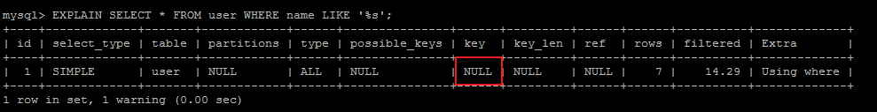

非前导模糊查询则可以使用索引，可优化为使用非前导模糊查询：

EXPLAIN SELECT * FROM user WHERE name LIKE 's%';

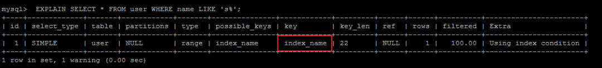

**3）数据类型出现隐式转换的时候不会命中索引，特别是当列类型是字符串，一定要将字符常量值用引号引起来。**

EXPLAIN SELECT * FROM user WHERE name=1;

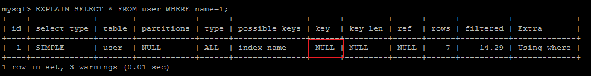

EXPLAIN SELECT * FROM user WHERE name='1';

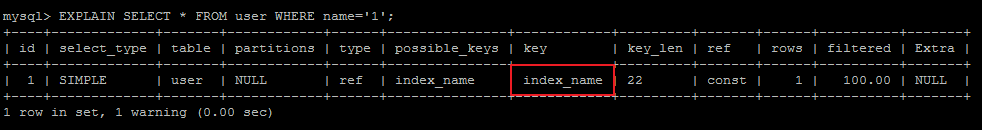

**4）复合索引的情况下，查询条件不包含索引列最左边部分（不满足最左原则），不会命中符合索引。**

（是不是相当于没有B+树的上面一层，自然找不到下面一层？ 有待考究 ）

name,age,status列创建复合索引：

ALTER TABLE user ADD INDEX index_name (name,age,status);

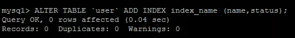

user表索引详情：

SHOW INDEX FROM user;

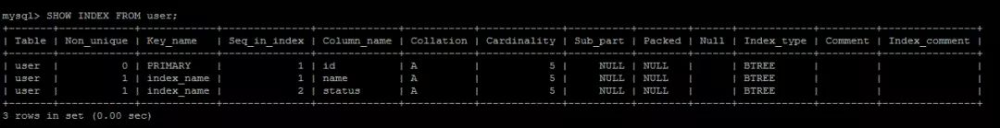

根据最左原则，可以命中复合索引index_name：

EXPLAIN SELECT * FROM user WHERE name='swj' AND status=1;

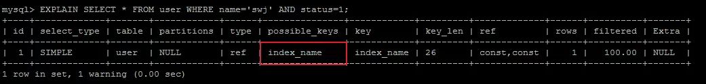

注意，最左原则并不是说是查询条件的顺序：

EXPLAIN SELECT * FROM user WHERE status=1 AND name='swj';

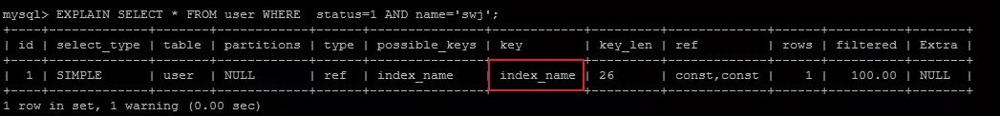

而是查询条件中是否包含索引最左列字段：

EXPLAIN SELECT * FROM user WHERE status=2 ;

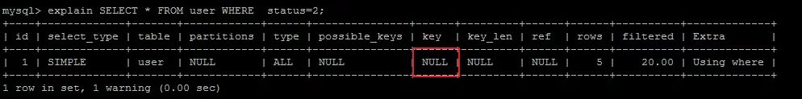

**5）union、in、or都能够命中索引，建议使用in。**

union:

EXPLAIN SELECT*FROM user WHERE status=1

UNION ALL

SELECT*FROM user WHERE status = 2;

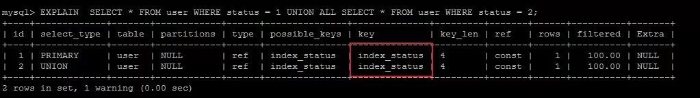

in:

EXPLAIN SELECT * FROM user WHERE status IN (1,2);

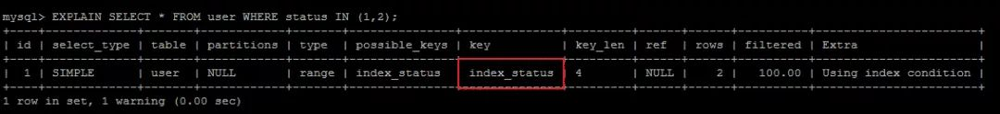

or:

EXPLAIN SELECT*FROM user WHERE status=1OR status=2;

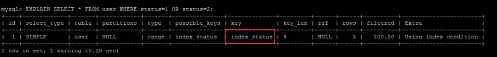

查询的CPU消耗：or>in>union。

**6）用or分割开的条件，如果or前的条件中列有索引，而后面的列中没有索引，那么涉及到的索引都不会被用到。**

EXPLAIN SELECT * FROM payment WHERE customer_id = 203 OR amount = 3.96;

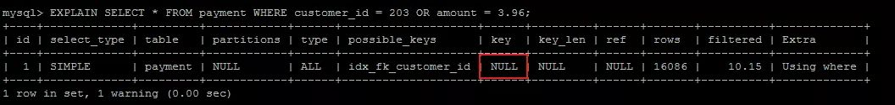

因为or后面的条件列中没有索引，那么后面的查询肯定要走全表扫描，在存在全表扫描的情况下，就没有必要多一次索引扫描增加IO访问。

**7）负向条件查询不能使用索引，可以优化为in查询。**

负向条件有：**!=、<>、not in、not exists、not like**等。

status列创建索引：

ALTER TABLE user ADD INDEX index_status (status);


user表索引详情：

SHOW INDEX FROM user;

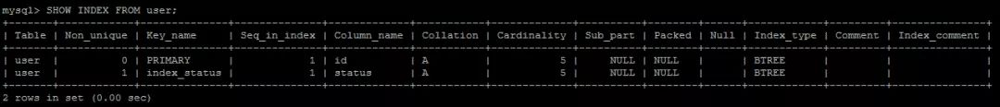

负向条件不能命中缓存：

EXPLAIN SELECT * FROM user WHERE status !=1 AND status != 2;

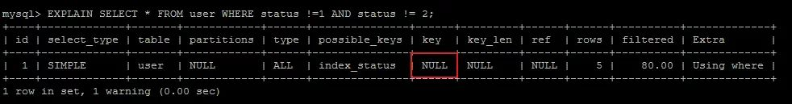

可以优化为in查询，但是前提是区分度要高，返回数据的比例在30%以内：

EXPLAIN SELECT * FROM user WHERE status IN (0,3,4);

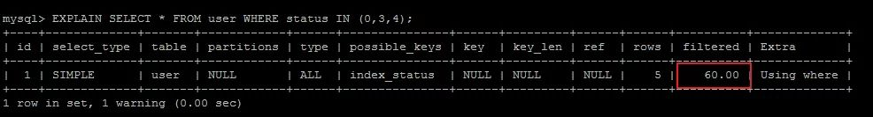

**8）范围条件查询可以命中索引。范围条件有：<、<=、>、>=、between等。**

status,age列分别创建索引：

ALTER TABLE user ADD INDEX index_status (status);

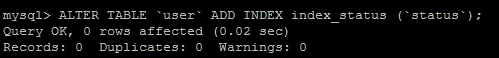

ALTER TABLE user ADD INDEX index_age (age);

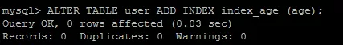

user表索引详情：

SHOW INDEX FROM user;

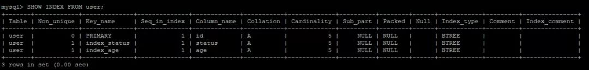

范围条件查询可以命中索引：

EXPLAIN SELECT * FROM user WHERE status>5;

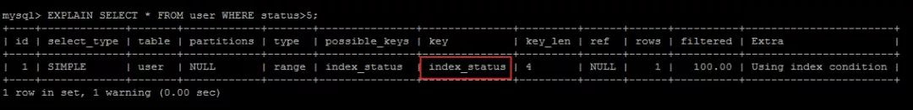

范围列可以用到索引（联合索引必须是最左前缀），但是范围列后面的列无法用到索引，索引最多用于一个范围列，如果查询条件中有两个范围列则无法全用到索引：

EXPLAIN SELECT * FROM user WHERE status>5 AND age<24;

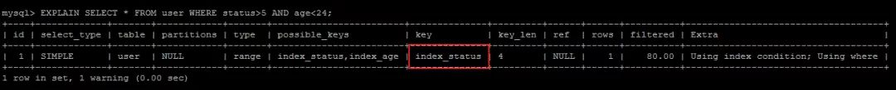

如果是范围查询和等值查询同时存在，优先匹配等值查询列的索引：

EXPLAIN SELECT * FROM user WHERE status>5 AND age=24;

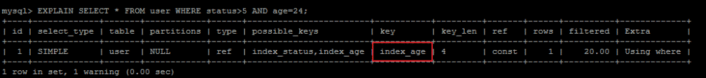

**8）数据库执行计算不会命中索引。**

EXPLAIN SELECT * FROM user WHERE age>24;

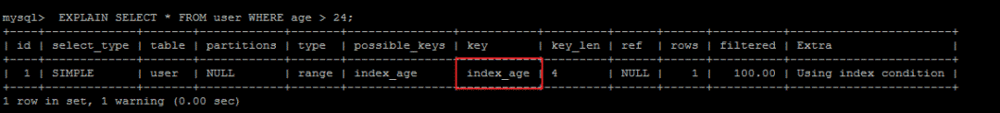

EXPLAIN SELECT * FROM user WHERE age+1>24;


计算逻辑应该尽量放到业务层处理，节省数据库的CPU的同时最大限度的命中索引。

**9）利用覆盖索引进行查询，避免回表。**

被查询的列，数据能从索引中取得，而不用通过行定位符row-locator再到row上获取，即“被查询列要被所建的索引覆盖”，这能够加速查询速度。

user表的索引详情：

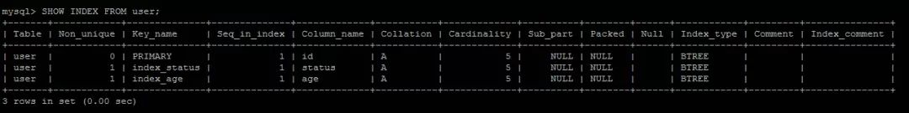

因为status字段是索引列，所以直接从索引中就可以获取值，不必回表查询：

Using Index代表从索引中查询：

EXPLAIN SELECT status FROM user where status=1;

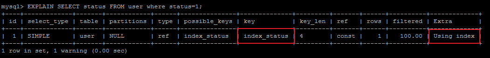

当查询其他列时，就需要回表查询，这也是为什么要避免SELECT*的原因之一：

EXPLAIN SELECT * FROM user where status=1;

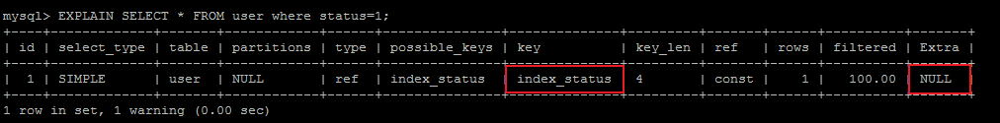

**10）建立索引的列，不允许为null。**

单列索引不存null值，复合索引不存全为null的值，如果列允许为null，可能会得到“不符合预期”的结果集，所以，请使用not null约束以及默认值。

remark列建立索引：

ALTER TABLE user ADD INDEX index_remark (remark);

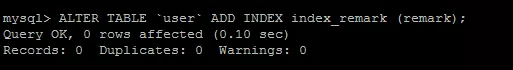

IS NULL可以命中索引：

EXPLAIN SELECT * FROM user WHERE remark IS NULL;

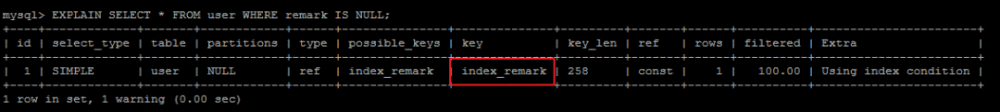

IS NOT NULL不能命中索引：

EXPLAIN SELECT * FROM user WHERE remark IS NOT NULL;


虽然IS NULL可以命中索引，但是NULL本身就不是一种好的数据库设计，应该使用NOT NULL约束以及默认值。


a. 更新十分频繁的字段上不宜建立索引：因为更新操作会变更B+树，重建索引。这个过程是十分消耗数据库性能的。

b. 区分度不大的字段上不宜建立索引：类似于性别这种区分度不大的字段，建立索引的意义不大。因为不能有效过滤数据，性能和全表扫描相当。另外返回数据的比例在30%以外的情况下，优化器不会选择使用索引。

c. 业务上具有唯一特性的字段，即使是多个字段的组合，也必须建成唯一索引。虽然唯一索引会影响insert速度，但是对于查询的速度提升是非常明显的。另外，即使在应用层做了非常完善的校验控制，只要没有唯一索引，在并发的情况下，依然有脏数据产生。

d. 多表关联时，要保证关联字段上一定有索引。

e. 创建索引时避免以下错误观念：索引越多越好，认为一个查询就需要建一个索引；宁缺勿滥，认为索引会消耗空间、严重拖慢更新和新增速度；抵制唯一索引，认为业务的唯一性一律需要在应用层通过“先查后插”方式解决；过早优化，在不了解系统的情况下就开始优化。


小结：

**对于自己编写的SQL查询语句，要尽量使用EXPLAIN命令分析一下，做一个对SQL性能有追求的程序员。衡量一个程序员是否靠谱，SQL能力是一个重要的指标。作为后端程序员，深以为然。**


参考：https://www.cnblogs.com/gdjk/p/10668868.html （这篇文章写得真好，美团的一位工程师）


补充：

#### explain

**用法：在select语句前加上explain**
显示mysql如何使用索引来处理select语句以及连接表，可以帮助选择更好的索引和写出更优化的查询语句

参考王道的文档，还有：https://www.jianshu.com/p/f29a619b3ee8


### 2.MySQL的分库分表几种思路

#### **数据库分表：**

维度：

#####  **垂直拆分**

 垂直分库（根据业务不同与微服务类似单独服务对应单独库）
 垂直分表

垂直分表是基于数据库中的”列”进行，某个表字段较多，可以新建一张扩展表，将不经常用或字段长度较大的字段拆分出去到扩展表中。在字段很多的情况下（例如一个大表有100多个字段），通过”大表拆小表”，更便于开发与维护，也**能避免跨页问题**，MySQL底层是通过数据页存储的，**一条记录占用空间过大会导致跨页，造成额外的性能开销**。另外数据库以行为单位将数据加载到内存中，这样表中字段长度较短且访问频率较高，内存能加载更多的数据，命中率更高，减少了磁盘IO，从而提升了数据库性能。

拆分字段的操作建议在数据库设计阶段就做好。如果是在发展过程中拆分，则需要改写以前的查询语句，会额外带来一定的成本和风险，建议谨慎。

 **垂直拆分优缺点：**

 **优点：**
解决业务系统层面的耦合，业务清晰
与微服务的治理类似，也能对不同业务的数据进行分级管理、维护、监控、扩展等
高并发场景下，垂直切分一定程度的提升IO、数据库连接数、单机硬件资源的瓶颈
 缺点：
部分表无法join，只能通过接口聚合方式解决，提升了开发的复杂度
依然存在单表数据量过大的问题（需要水平切分）
分布式事务处理复杂


#####  水平拆分

（根据表内数据内在的逻辑关系，将同一个表按不同的条件分散到多个数据库或多个表中，每个表中只包含一部分数据，从而使得单个表的数据量变小，达到分布式的效果。）

 **水平拆分优缺点：**
 优点：
不存在单库数据量过大、高并发的性能瓶颈，提升系统稳定性和负载能力
应用端改造较小，不需要拆分业务模块
“冷热数据分离”实现方案
 缺点：
跨分片事务难以保证
跨分片的复杂查询如join关联查询
数据多次扩展难度和维护量极大


#####  数据分片规则

 冷热数据隔离（近6个月或者1年的数据作为热数据，历史数据作为冷数据再进行时间维度拆分）
 地域区域或者其他拆分方式
 userNo范围分表，比如0~500w用户在user1表，501w-1000w在user2表等
 优点：
单表大小可控
天然便于水平扩展，后期如果想对整个分片集群扩容时，只需要添加节点即可，无需对其他分片的数 据进行迁移
使用分片字段进行范围查找时，连续分片可快速定位分片进行快速查询，有效避免跨分片查询的问题
 缺点：
热点数据成为性能瓶颈。连续分片可能存在数据热点


#####  hash取模mod的切分方式

 优点：根据主键id进行数据切分，达到数据均匀分布，使用一致性hash算法可以避免后期扩展问题
 缺点：跨分片聚合操作


## 2020.4.19

### 1.线程池常用的七个参数设置？

#### 线程池常用的七个参数，重要的三个：

**`ThreadPoolExecutor` 3 个最重要的参数）**（先判断核心线程数-->然后判断队列，队列满了-->判断最大容量）

- **`corePoolSize` :** 核心线程数线程数定义了**最小可以同时运行的线程数量**。（即使这些线程处于空闲状态，这些线程也不会被销毁）
- **`maximumPoolSize` :** 当队列中存放的任务达到队列容量的时候，**当前可以同时运行的线程数量变为最大线程数**。
- **`workQueue`:** 当新任务来的时候会**先判断当前运行的线程数量是否达到核心线程数**，**如果达到的话，新任务就会被存放在队列中**。

`ThreadPoolExecutor`其他常见参数:

1. **`keepAliveTime`**:当线程池中的线程数量大于 `corePoolSize` 的时候，如果这时没有新的任务提交，核心线程外的线程不会立即销毁，而是会等待，直到等待的时间超过了 `keepAliveTime`才会被回收销毁；
2. **`unit`** : `keepAliveTime` 参数的时间单位。
3. **`threadFactory`** :executor 创建新线程的时候会用到。
4. **`handler`** :饱和策略。关于饱和策略下面单独介绍一下。

下面这张图可以加深你对线程池中各个参数的相互关系的理解（图片来源：《Java 性能调优实战》）：


按照阿里巴巴推荐的设置：

```java
import java.util.concurrent.ArrayBlockingQueue;
import java.util.concurrent.ThreadPoolExecutor;
import java.util.concurrent.TimeUnit;

public class ThreadPoolExecutorDemo {

    private static final int CORE_POOL_SIZE = 5;
    private static final int MAX_POOL_SIZE = 10;
    private static final int QUEUE_CAPACITY = 100;
    private static final Long KEEP_ALIVE_TIME = 1L;
    public static void main(String[] args) {

        //使用阿里巴巴推荐的创建线程池的方式
        //通过ThreadPoolExecutor构造函数自定义参数创建
        ThreadPoolExecutor executor = new ThreadPoolExecutor(
                CORE_POOL_SIZE,
                MAX_POOL_SIZE,
                KEEP_ALIVE_TIME,
                TimeUnit.SECONDS,
                new ArrayBlockingQueue<>(QUEUE_CAPACITY),
                new ThreadPoolExecutor.CallerRunsPolicy());

        for (int i = 0; i < 10; i++) {
            //创建WorkerThread对象（WorkerThread类实现了Runnable 接口）
            Runnable worker = new MyRunnable("" + i);
            //执行Runnable
            executor.execute(worker);
        }
        //终止线程池
        executor.shutdown();
        while (!executor.isTerminated()) {
        }
        System.out.println("Finished all threads");
    }
}
```

可以看到我们上面的代码指定了：

1. `corePoolSize`: 核心线程数为 5。
2. `maximumPoolSize` ：最大线程数 10
3. `keepAliveTime` : 等待时间为 1L。
4. `unit`: 等待时间的单位为 TimeUnit.SECONDS。
5. `workQueue`：任务队列为 `ArrayBlockingQueue`，并且容量为 100;
6. `handler`:饱和策略为 `CallerRunsPolicy`。

### 2.常用的几种线程池原码里面参数是怎么样的，缺点是什么样的？平时创建线程的时候，推荐用那种线程池？

#### 1 FixedThreadPool

##### 1.1 介绍

`FixedThreadPool` 被称为可重用固定线程数的线程池。通过 Executors 类中的相关源代码来看一下相关实现：

```java
   /**
     * 创建一个可重用固定数量线程的线程池
     */
    public static ExecutorService newFixedThreadPool(int nThreads, ThreadFactory threadFactory) {
        return new ThreadPoolExecutor(nThreads, nThreads,
                                      0L, TimeUnit.MILLISECONDS,
                                      new LinkedBlockingQueue<Runnable>(),
                                      threadFactory);
    }
```

另外还有一个 `FixedThreadPool` 的实现方法，和上面的类似，所以这里不多做阐述：

```java
    public static ExecutorService newFixedThreadPool(int nThreads) {
        return new ThreadPoolExecutor(nThreads, nThreads,
                                      0L, TimeUnit.MILLISECONDS,
                                      new LinkedBlockingQueue<Runnable>());
    }
```

**从上面源代码可以看出新创建的 `FixedThreadPool` 的 `corePoolSize` 和 `maximumPoolSize` 都被设置为 nThreads，这个 nThreads 参数是我们使用的时候自己传递的。**

##### 1.2 执行任务过程介绍

`FixedThreadPool` 的 `execute()` 方法运行示意图（该图片来源：《Java 并发编程的艺术》）：


**上图说明：**

1. 如果当前运行的线程数小于 corePoolSize， 如果再来新任务的话，就创建新的线程来执行任务；
2. 当前运行的线程数等于 corePoolSize 后， 如果再来新任务的话，会将任务加入 `LinkedBlockingQueue`；
3. 线程池中的线程执行完 手头的任务后，会在循环中反复从 `LinkedBlockingQueue` 中获取任务来执行；

##### 1.3 为什么不推荐使用`FixedThreadPool`？

**`FixedThreadPool` 使用无界队列 `LinkedBlockingQueue`（队列的容量为 Intger.MAX_VALUE）作为线程池的工作队列会对线程池带来如下影响 ：**

1. 当线程池中的线程数达到 `corePoolSize` 后，新任务将在无界队列中等待，因此线程池中的线程数不会超过 corePoolSize；
2. 由于使用无界队列时 `maximumPoolSize` 将是一个无效参数，因为不可能存在任务队列满的情况。所以，通过创建 `FixedThreadPool`的源码可以看出创建的 `FixedThreadPool` 的 `corePoolSize` 和 `maximumPoolSize` 被设置为同一个值。
3. 由于 1 和 2，使用无界队列时 `keepAliveTime` 将是一个无效参数；
4. 运行中的 `FixedThreadPool`（未执行 `shutdown()`或 `shutdownNow()`）不会拒绝任务，在任务比较多的时候会导致 OOM（内存溢出）。

#### 2 SingleThreadExecutor 详解

##### 2.1 介绍

`SingleThreadExecutor` 是只有一个线程的线程池。下面看看**SingleThreadExecutor 的实现：**

```java
   /**
     *返回只有一个线程的线程池
     */
    public static ExecutorService newSingleThreadExecutor(ThreadFactory threadFactory) {
        return new FinalizableDelegatedExecutorService
            (new ThreadPoolExecutor(1, 1,
                                    0L, TimeUnit.MILLISECONDS,
                                    new LinkedBlockingQueue<Runnable>(),
                                    threadFactory));
    }
```

```java
   public static ExecutorService newSingleThreadExecutor() {
        return new FinalizableDelegatedExecutorService
            (new ThreadPoolExecutor(1, 1,
                                    0L, TimeUnit.MILLISECONDS,
                                    new LinkedBlockingQueue<Runnable>()));
    }
```

从上面源代码可以看出新创建的 `SingleThreadExecutor` 的 `corePoolSize` 和 `maximumPoolSize` 都被设置为 1.其他参数和 `FixedThreadPool` 相同。

##### 2.2 执行任务过程介绍

**`SingleThreadExecutor` 的运行示意图（该图片来源：《Java 并发编程的艺术》）：**


**上图说明;**

1. 如果当前运行的线程数少于 corePoolSize，则创建一个新的线程执行任务；
2. 当前线程池中有一个运行的线程后，将任务加入 `LinkedBlockingQueue`
3. 线程执行完当前的任务后，会在循环中反复从`LinkedBlockingQueue` 中获取任务来执行；

##### 2.3 为什么不推荐使用`SingleThreadExecutor`？

`SingleThreadExecutor` 使用无界队列 `LinkedBlockingQueue` 作为线程池的工作队列（队列的容量为 Intger.MAX_VALUE）。`SingleThreadExecutor` 使用无界队列作为线程池的工作队列会对线程池带来的影响与 `FixedThreadPool` 相同。说简单点就是可能会导致 OOM，

#### 3 CachedThreadPool 详解

##### 3.1 介绍

`CachedThreadPool` 是一个会根据需要创建新线程的线程池。下面通过源码来看看 `CachedThreadPool` 的实现：

```java
    /**
     * 创建一个线程池，根据需要创建新线程，但会在先前构建的线程可用时重用它。
     */
    public static ExecutorService newCachedThreadPool(ThreadFactory threadFactory) {
        return new ThreadPoolExecutor(0, Integer.MAX_VALUE,
                                      60L, TimeUnit.SECONDS,
                                      new SynchronousQueue<Runnable>(),
                                      threadFactory);
    }

```

```java
    public static ExecutorService newCachedThreadPool() {
        return new ThreadPoolExecutor(0, Integer.MAX_VALUE,
                                      60L, TimeUnit.SECONDS,
                                      new SynchronousQueue<Runnable>());
    }
```

`CachedThreadPool` 的`corePoolSize` 被设置为空（0），`maximumPoolSize`被设置为 Integer.MAX.VALUE，即它是无界的，这也就意味着如果主线程提交任务的速度高于 `maximumPool` 中线程处理任务的速度时，`CachedThreadPool` 会不断创建新的线程。极端情况下，这样会导致耗尽 cpu 和内存资源。

##### 3.2 执行任务过程介绍

**CachedThreadPool 的 execute()方法的执行示意图（该图片来源：《Java 并发编程的艺术》）：**


**上图说明：**

1. 首先执行 `SynchronousQueue.offer(Runnable task)` 提交任务到任务队列。如果当前 `maximumPool` 中有闲线程正在执行 `SynchronousQueue.poll(keepAliveTime,TimeUnit.NANOSECONDS)`，那么主线程执行 offer 操作与空闲线程执行的 `poll` 操作配对成功，主线程把任务交给空闲线程执行，`execute()`方法执行完成，否则执行下面的步骤 2；
2. 当初始 `maximumPool` 为空，或者 `maximumPool` 中没有空闲线程时，将没有线程执行 `SynchronousQueue.poll(keepAliveTime,TimeUnit.NANOSECONDS)`。这种情况下，步骤 1 将失败，此时 `CachedThreadPool` 会创建新线程执行任务，execute 方法执行完成；

##### 3.3 为什么不推荐使用`CachedThreadPool`？

`CachedThreadPool`允许创建的线程数量为 Integer.MAX_VALUE ，可能会创建大量线程，从而导致 OOM。

## 2020.4.23

### 1.Callable和Runable有什么区别，run()和start()有什么区别，join()和yield()有什么区别，execute()和submit（）的区别，shutdown（）和shutdownNow（）的区别，isTerminated()和isShutdown()区别

#### 1 `Runnable` vs `Callable`

`Runnable`自 Java 1.0 以来一直存在，但`Callable`仅在 Java 1.5 中引入,目的就是为了来处理`Runnable`不支持的用例。**`Runnable` 接口**不会返回结果或抛出检查异常，但是**`Callable` 接口**可以。所以，如果任务不需要返回结果或抛出异常推荐使用 **`Runnable` 接口**，这样代码看起来会更加简洁。

工具类 `Executors` 可以实现 `Runnable` 对象和 `Callable` 对象之间的相互转换。（`Executors.callable（Runnable task`）或 `Executors.callable（Runnable task，Object resule）`）。

`Runnable.java`

```java
@FunctionalInterface
public interface Runnable {
   /**
    * 被线程执行，没有返回值也无法抛出异常
    */
    public abstract void run();
}
```

`Callable.java`

```java
@FunctionalInterface
public interface Callable<V> {
    /**
     * 计算结果，或在无法这样做时抛出异常。
     * @return 计算得出的结果
     * @throws 如果无法计算结果，则抛出异常
     */
    V call() throws Exception;
}

```

#### 2 `execute()` vs `submit()`

1. **`execute()`方法用于提交不需要返回值的任务，所以无法判断任务是否被线程池执行成功与否；**
2. **`submit()`方法用于提交需要返回值的任务。线程池会返回一个 `Future` 类型的对象，通过这个 `Future` 对象可以判断任务是否执行成功**，并且可以通过 `Future` 的 `get()`方法来获取返回值，`get()`方法会阻塞当前线程直到任务完成，而使用 `get（long timeout，TimeUnit unit）`方法则会阻塞当前线程一段时间后立即返回，这时候有可能任务没有执行完。

我们以**`AbstractExecutorService`**接口中的一个 `submit` 方法为例子来看看源代码：

```java
    public Future<?> submit(Runnable task) {
        if (task == null) throw new NullPointerException();
        RunnableFuture<Void> ftask = newTaskFor(task, null);
        execute(ftask);
        return ftask;
    }
```

上面方法调用的 `newTaskFor` 方法返回了一个 `FutureTask` 对象。

```java
    protected <T> RunnableFuture<T> newTaskFor(Runnable runnable, T value) {
        return new FutureTask<T>(runnable, value);
    }
```

我们再来看看`execute()`方法：

```java
    public void execute(Runnable command) {
      ...
    }
```

#### 3 `shutdown()`VS`shutdownNow()`

- **`shutdown（）`** :关闭线程池，线程池的状态变为 `SHUTDOWN`。线程池不再接受新任务了，但是队列里的任务得执行完毕。
- **`shutdownNow（）`** :关闭线程池，线程的状态变为 `STOP`。线程池会终止当前正在运行的任务，并停止处理排队的任务并返回正在等待执行的 List。

#### 4 `isTerminated()` VS `isShutdown()`

- **`isShutDown`** 当调用 `shutdown()` 方法后返回为 true。
- **`isTerminated`** 当调用 `shutdown()` 方法后，并且所有提交的任务完成后返回为 true

#### 5.run( ) VS  start（）

```java
public class CallableDemo1 {
    public static void main(String[] args) {
        //创建方式有点和前两种都不一样
        MyCallable callable1 = new MyCallable();
        MyCallable callable2 = new MyCallable();
        MyCallable callable3 = new MyCallable();
        FutureTask<String> task1 = new FutureTask<String>(callable1);
        FutureTask<String> task2 = new FutureTask<String>(callable1);
        FutureTask<String> task3 = new FutureTask<String>(callable1);
        new Thread(task1,"窗口1：").run();
        new Thread(task2,"窗口2：").run();
        new Thread(task3,"窗口3：").run();
        
        try {
            System.out.println("窗口1返回的结果为：" + task1.get());
            System.out.println("窗口2返回的结果为：" + task2.get());
            System.out.println("窗口3返回的结果为：" + task3.get());
        } catch (InterruptedException e) {
            e.printStackTrace();
        } catch (ExecutionException e) {
            e.printStackTrace();
        }
    }
}
```

看上面线程创建的第三种方式，如果把.start(),修改为.run(),结果会怎么呢？

```java
main:正在卖票，剩下票数：29
main:正在卖票，剩下票数：28
main:正在卖票，剩下票数：27
main:正在卖票，剩下票数：26
main:正在卖票，剩下票数：25
main:正在卖票，剩下票数：24
main:正在卖票，剩下票数：23
main:正在卖票，剩下票数：22
main:正在卖票，剩下票数：21
main:正在卖票，剩下票数：20
main:正在卖票，剩下票数：19
main:正在卖票，剩下票数：18
main:正在卖票，剩下票数：17
main:正在卖票，剩下票数：16
main:正在卖票，剩下票数：15
main:正在卖票，剩下票数：14
main:正在卖票，剩下票数：13
main:正在卖票，剩下票数：12
main:正在卖票，剩下票数：11
main:正在卖票，剩下票数：10
main:正在卖票，剩下票数：9
main:正在卖票，剩下票数：8
main:正在卖票，剩下票数：7
main:正在卖票，剩下票数：6
main:正在卖票，剩下票数：5
main:正在卖票，剩下票数：4
main:正在卖票，剩下票数：3
main:正在卖票，剩下票数：2
main:正在卖票，剩下票数：1
main:正在卖票，剩下票数：0
窗口1返回的结果为：票卖完了
窗口2返回的结果为：票卖完了
窗口3返回的结果为：票卖完了
```

就是说，调用start（）方法，其实执行的是异步操作，三个线程进行售票。

如果在main（）方法里面调用的是run（）方法，则进行的是同步操作，就是说，其实只有main方法在执行。

#### 6.join()  VS  yield()

线程的转换状态：


线程的生命周期：


由上面图可以看出：

**yield（）**（这个也叫礼让状态）方法和  sleep() 方法类似，也不会释放“锁标志”，区别在于，它没有参数，即yield()方法只是使当前线程重新回到可执行状态，所以执行yield()的线程有可能在进入到可执行状态后马上又被执行，另外yield()方法**只能使同优先级或者高优先级的线程得到执行机会**，这也和sleep()方法不同。
**join()** （这个也叫自闭状态）方法会使当前线程等待调用join()方法的线程结束后才能继续执行，例如：

```java
public class TestJoin {

    public static void main(String[] args) {
        Thread thread = new Thread(new JoinDemo());
        thread.start();

        for (int i = 0; i < 20; i++) {
            System.out.println("主线程第" + i + "次执行！");
            if (i >= 2)
                try {
                   // t1线程合并到主线程中，主线程停止执行过程，转而执行t1线程，直到t1执行完毕后继续。
                    thread.join();
                } catch (InterruptedException e) {
                    e.printStackTrace();
                }
        }
    }
}

class JoinDemo implements Runnable {

    @Override
    public void run() {
        for (int i = 0; i < 10; i++) {
            System.out.println("线程1第" + i + "次执行！");
        }
    }
}
```

运行结果：

```java
主线程第0次执行！
主线程第1次执行！
主线程第2次执行！
线程1第0次执行！
线程1第1次执行！
线程1第2次执行！
线程1第3次执行！
线程1第4次执行！
线程1第5次执行！
线程1第6次执行！
线程1第7次执行！
线程1第8次执行！
线程1第9次执行！
主线程第3次执行！
主线程第4次执行！
主线程第5次执行！
主线程第6次执行！
主线程第7次执行！
主线程第8次执行！
主线程第9次执行！
主线程第10次执行！
主线程第11次执行！
主线程第12次执行！
主线程第13次执行！
主线程第14次执行！
主线程第15次执行！
主线程第16次执行！
主线程第17次执行！
主线程第18次执行！
主线程第19次执行！
```


参考：https://www.cnblogs.com/aqiu-jiang/p/11850692.html

#### 7.sleep()  VS  wait() 

- 两者最主要的区别在于：**sleep 方法没有释放锁，而 wait 方法释放了锁** 。
- 两者都可以暂停线程的执行。
- Wait 通常被用于线程间交互/通信，sleep 通常被用于暂停执行。
- wait() 方法被调用后，线程不会自动苏醒，需要别的线程调用同一个对象上的 notify() 或者 notifyAll() 方法。sleep() 方法执行完成后，线程会自动苏醒。或者可以使用 wait(long timeout)超时后线程会自动苏醒。

### 2.乐观锁和悲观锁区别和使用

#### 乐观锁：

总是假设最好的情况，每次去拿数据的时候都认为别人不会修改，所以不会上锁，但是在更新的时候会判断一下在此期间别人有没有去更新这个数据，可以使用版本号机制和CAS算法实现。乐观锁适用于多读的应用类型，这样可以提高吞吐量，像数据库提供的类似于write_condition机制，其实都是提供的乐观锁。在Java中java.util.concurrent.atomic包下面的原子变量类就是使用了乐观锁的一种实现方式CAS实现的。

#### 悲观锁：

总是假设最坏的情况，每次去拿数据的时候都认为别人会修改，所以每次在拿数据的时候都会上锁，这样别人想拿这个数据就会阻塞直到它拿到锁（共享资源每次只给一个线程使用，其它线程阻塞，用完后再把资源转让给其它线程）。传统的关系型数据库里边就用到了很多这种锁机制，比如行锁，表锁等，读锁，写锁等，都是在做操作之前先上锁。Java中synchronized和ReentrantLock等独占锁就是悲观锁思想的实现。


#### 乐观锁应用：

##### 1.版本号机制（项目中使用的是每次更新数据以后更新时间，判断时间是不是一样）

​		一般是在数据表中加上一个数据版本号version字段，表示数据被修改的次数，当数据被修改时，version值会加一。当线程A要更新数据值时，在读取数据的同时也会读取version值，在提交更新时，若刚才读取到的version值为当前数据库中的version值相等时才更新，否则重试更新操作，直到更新成功。

举一个简单的例子：

假设数据库中帐户信息表中有一个 version 字段，当前值为 1 ；而当前帐户余额字段（ balance ）为 $100 。当需要对账户信息表进行更新的时候，需要首先读取version字段。

操作员 A 此时将其读出（ version=1 ），并从其帐户余额中扣除 $50（ $100-$50 ）。
在操作员 A 操作的过程中，操作员B 也读入此用户信息（ version=1 ），并从其帐户余额中扣除 $20 （ $100-$20 ）。
操作员 A 完成了修改工作，提交更新之前会先看数据库的版本和自己读取到的版本是否一致，一致的话，就会将数据版本号加1（ version=2 ），连同帐户扣除后余额（ balance=$50 ），提交至数据库更新，此时由于提交数据版本大于数据库记录当前版本，数据被更新，数据库记录 version 更新为 2 。
操作员 B 完成了操作，提交更新之前会先看数据库的版本和自己读取到的版本是否一致，但此时比对数据库记录版本时发现，操作员 B 提交的数据版本号为 2 ，而自己读取到的版本号为1 ，不满足 “ 当前最后更新的version与操作员第一次读取的版本号相等 “ 的乐观锁策略，因此，操作员 B 的提交被驳回。
这样，就避免了操作员 B 用基于 version=1 的旧数据修改的结果覆盖操作员A 的操作结果的可能。

##### 2.CAS算法

即compare and swap（比较与交换），是一种有名的无锁算法。无锁编程，即不使用锁的情况下实现多线程之间的变量同步，也就是在没有线程被阻塞的情况下实现变量的同步，所以也叫非阻塞同步（Non-blocking Synchronization）。CAS算法涉及到三个操作数

需要读写的内存值 V
进行比较的值 A
拟写入的新值 B
当且仅当 V 的值等于 A时，CAS通过原子方式用新值B来更新V的值，否则不会执行任何操作（比较和替换是一个原子操作）。一般情况下是一个自旋操作，即不断的重试。

#### 乐观锁的缺点

ABA 问题是乐观锁一个常见的问题

##### 1 ABA 问题

如果一个变量V初次读取的时候是A值，并且在准备赋值的时候检查到它仍然是A值，那我们就能说明它的值没有被其他线程修改过了吗？很明显是不能的，因为在这段时间它的值可能被改为其他值，然后又改回A，那CAS操作就会误认为它从来没有被修改过。这个问题被称为CAS操作的 "ABA"问题。

JDK 1.5 以后的 AtomicStampedReference 类就提供了此种能力，其中的 compareAndSet 方法就是首先检查当前引用是否等于预期引用，并且当前标志是否等于预期标志，如果全部相等，则以原子方式将该引用和该标志的值设置为给定的更新值。

## 2020.4.26

### 1.JDK1.6 之后的底层优化（偏向锁，轻量级锁，自旋锁和自适应自旋，锁消除，锁粗化）

JDK1.6 对锁的实现引入了大量的优化，如偏向锁、轻量级锁、自旋锁、适应性自旋锁、锁消除、锁粗化等技术来减少锁操作的开销。

锁主要存在四中状态，依次是：无锁状态、偏向锁状态、轻量级锁状态、重量级锁状态，他们会随着竞争的激烈而逐渐升级。注意锁可以升级不可降级，这种策略是为了提高获得锁和释放锁的效率。

**①偏向锁**

**引入偏向锁的目的和引入轻量级锁的目的很像，他们都是为了没有多线程竞争的前提下，减少传统的重量级锁使用操作系统互斥量产生的性能消耗。但是不同是：轻量级锁在无竞争的情况下使用 CAS 操作去代替使用互斥量。而偏向锁在无竞争的情况下会把整个同步都消除掉**。

偏向锁的“偏”就是偏心的偏，它的意思是会偏向于第一个获得它的线程，如果在接下来的执行中，该锁没有被其他线程获取，那么持有偏向锁的线程就不需要进行同步！关于偏向锁的原理可以查看《深入理解Java虚拟机：JVM高级特性与最佳实践》第二版的13章第三节锁优化。

但是对于锁竞争比较激烈的场合，偏向锁就失效了，因为这样场合极有可能每次申请锁的线程都是不相同的，因此这种场合下不应该使用偏向锁，否则会得不偿失，需要注意的是，偏向锁失败后，并不会立即膨胀为重量级锁，而是先升级为轻量级锁。

**② 轻量级锁**

倘若偏向锁失败，虚拟机并不会立即升级为重量级锁，它还会尝试使用一种称为轻量级锁的优化手段(1.6之后加入的)。**轻量级锁不是为了代替重量级锁，它的本意是在没有多线程竞争的前提下，减少传统的重量级锁使用操作系统互斥量产生的性能消耗，因为使用轻量级锁时，不需要申请互斥量。另外，轻量级锁的加锁和解锁都用到了CAS操作。** 关于轻量级锁的加锁和解锁的原理可以查看《深入理解Java虚拟机：JVM高级特性与最佳实践》第二版的13章第三节锁优化。

**轻量级锁能够提升程序同步性能的依据是“对于绝大部分锁，在整个同步周期内都是不存在竞争的”，这是一个经验数据。如果没有竞争，轻量级锁使用 CAS 操作避免了使用互斥操作的开销。但如果存在锁竞争，除了互斥量开销外，还会额外发生CAS操作，因此在有锁竞争的情况下，轻量级锁比传统的重量级锁更慢！如果锁竞争激烈，那么轻量级将很快膨胀为重量级锁！**

**③  自旋锁和自适应自旋**

轻量级锁失败后，虚拟机为了避免线程真实地在操作系统层面挂起，还会进行一项称为自旋锁的优化手段。

互斥同步对性能最大的影响就是阻塞的实现，因为挂起线程/恢复线程的操作都需要转入内核态中完成（用户态转换到内核态会耗费时间）。

**一般线程持有锁的时间都不是太长，所以仅仅为了这一点时间去挂起线程/恢复线程是得不偿失的。** 所以，虚拟机的开发团队就这样去考虑：“我们能不能让后面来的请求获取锁的线程等待一会而不被挂起呢？看看持有锁的线程是否很快就会释放锁”。**为了让一个线程等待，我们只需要让线程执行一个忙循环（自旋），这项技术就叫做自旋**。

百度百科对自旋锁的解释：

> 何谓自旋锁？它是为实现保护共享资源而提出一种锁机制。其实，自旋锁与互斥锁比较类似，它们都是为了解决对某项资源的互斥使用。无论是互斥锁，还是自旋锁，在任何时刻，最多只能有一个保持者，也就说，在任何时刻最多只能有一个执行单元获得锁。但是两者在调度机制上略有不同。对于互斥锁，如果资源已经被占用，资源申请者只能进入睡眠状态。但是自旋锁不会引起调用者睡眠，如果自旋锁已经被别的执行单元保持，调用者就一直循环在那里看是否该自旋锁的保持者已经释放了锁，"自旋"一词就是因此而得名。

自旋锁在 JDK1.6 之前其实就已经引入了，不过是默认关闭的，需要通过`--XX:+UseSpinning`参数来开启。JDK1.6及1.6之后，就改为默认开启的了。需要注意的是：自旋等待不能完全替代阻塞，因为它还是要占用处理器时间。如果锁被占用的时间短，那么效果当然就很好了！反之，相反！自旋等待的时间必须要有限度。如果自旋超过了限定次数任然没有获得锁，就应该挂起线程。**自旋次数的默认值是10次，用户可以修改`--XX:PreBlockSpin`来更改**。

另外,**在 JDK1.6 中引入了自适应的自旋锁。自适应的自旋锁带来的改进就是：自旋的时间不在固定了，而是和前一次同一个锁上的自旋时间以及锁的拥有者的状态来决定，虚拟机变得越来越“聪明”了**。

**④ 锁消除**

锁消除理解起来很简单，它指的就是虚拟机即使编译器在运行时，如果检测到那些共享数据不可能存在竞争，那么就执行锁消除。锁消除可以节省毫无意义的请求锁的时间。

**⑤ 锁粗化**

原则上，我们在编写代码的时候，总是推荐将同步块的作用范围限制得尽量小，——直在共享数据的实际作用域才进行同步，这样是为了使得需要同步的操作数量尽可能变小，如果存在锁竞争，那等待线程也能尽快拿到锁。

大部分情况下，上面的原则都是没有问题的，但是如果一系列的连续操作都对同一个对象反复加锁和解锁，那么会带来很多不必要的性能消耗。


其实JavaGuide里面没有说清楚，在《深入理解JVM虚拟机》P400，后面还有一句话：

比如代码：

```java
public String concatString(String s1,String s2,String s3){
    StringBuffer sb = new StringBuffer();
    sb.append(s1);
    sb.append(s2);
    sb.append(s3);
    return sb.toString();
}
```

如果虚拟机探测到这样一串操作都是对一个对象加锁，那么将会把锁同步的范围扩展（粗化）到整个操作系统序列化的外部，会将锁扩展到第一个append（）之前，或者最后一个append（）之后，这样值只需要加一次锁即可。

### 2.i++线程安全吗？

如果这里的i是局部变量，肯定是安全的，其他线程调用不到它，这里主要讨论的是i是全局变量的时候，是不是线程安全的。

答案当然不是线程安全的。因为这个操作既不满足内存可见性，也不满足原子性。


先来看下面的示例来验证下 i++ 到底是不是线程安全的。

1000个线程，每个线程对共享变量 count 进行 1000 次 ++ 操作。

```java
public class ThreadSafeTest {
	static int count = 0;
	static CountDownLatch cd1 = new CountDownLatch(1000);

	public static void main(String[] args) throws InterruptedException {
		CountRunnable countRunnable = new CountRunnable();
		for (int i = 0; i < 1000; i++) {
			new Thread(countRunnable).start();
		}
		cd1.await();
		System.out.println(count);
	}

	static class CountRunnable implements Runnable {
		private void count() {
			for (int i = 0; i < 1000; i++) {
				count++;
			}
		}

		@Override
		public void run() {
			count();
			cd1.countDown();
		}
	}
}
```

上面的例子我们期望的结果应该是 1000000，但运行 N 遍，你会发现总是不为 1000000，至少你现在知道了 i++
操作它不是线程安全的了。

（上面代码亲自测试过，只有很少的时候才会出现1000000，多数时候都是比它小很多）

#### JMM 模型中对共享变量的读写原理。


**每个线程都有自己的工作内存，每个线程需要对共享变量操作时必须先把共享变量从主内存 load 到自己的工作内存，等完成对共享变量的操作时再 save 到主内存。**

问题就出在这了，如果一个线程运算完后还没刷到主内存，此时这个共享变量的值被另外一个线程从主内存读取到了，这个时候读取的数据就是脏数据了，它会覆盖其他线程计算完的值。。。

这也是经典的内存不可见问题，那么把 count 加上 volatile 让内存可见是否能解决这个问题呢？ 答案是：不能。因为
**volatile 只能保证可见性，不能保证原子性**。多个线程同时读取这个共享变量的值，就算保证其他线程修改的可见性，也不能保证线程之间读取到同样的值然后相互覆盖对方的值的情况。

关于多线程的几种关键概念请翻阅《多线程之原子性、可见性、有序性详解》这篇文章。

#### 解决方案

- 说了这么多，对于 i++ 这种线程不安全问题有没有其他解决方案呢？当然有，请参考以下几种解决方案。

  1、对 i++ 操作的方法加同步锁，同时只能有一个线程执行 i++ 操作；

  ```java
  private synchronized void count() {  //synchronized 关键字既可以保证可见性，也可以保证原子性
      for (int i = 0; i < 1000; i++) {
          count++;
      }
  }
  ```

  2、使用支持原子性操作的类，如 **java.util.concurrent.atomic.AtomicInteger**，它使用的是
  CAS 算法，效率优于第 1 种;

  ```java
  public class ThreadSafeTest {
  	//static int count = 0;
  	static AtomicInteger count = new AtomicInteger();
  	static CountDownLatch cd1 = new CountDownLatch(1000);
  
  	public static void main(String[] args) throws InterruptedException {
  		CountRunnable countRunnable = new CountRunnable();
  		for (int i = 0; i < 1000; i++) {
  			new Thread(countRunnable).start();
  		}
  		cd1.await();
  		System.out.println(count);
  	}
  
  	static class CountRunnable implements Runnable {
  		private void count() {
  			for (int i = 0; i < 1000; i++) {
  				//count++;
  				count.getAndIncrement();
  			}
  		}
  
  		@Override
  		public void run() {
  			count();
  			cd1.countDown();
  		}
  	}
  }
  ```


参考：https://segmentfault.com/a/1190000015401766 （segmentfault上面一篇好文章）

上面解决方法用到， CountDownLatch  参考：https://www.jianshu.com/p/e233bb37d2e6 见下面文章

## 2020.5.14

## 注册中心Eureka

Eureka是Netflix开源的一款提供服务注册和发现的产品，它提供了完整的Service Registry和Service Discovery实现。也是springcloud体系中最重要最核心的组件之一。

### 背景介绍

#### 服务中心

服务中心又称注册中心，管理各种服务功能包括服务的注册、发现、熔断、负载、降级等，比如dubbo admin后台的各种功能。

有了服务中心调用关系会有什么变化，画几个简图来帮忙理解

项目A调用项目B

正常调用项目A请求项目B


有了服务中心之后，任何一个服务都不能直接去掉用，都需要通过服务中心来调用


项目A调用项目B，项目B在调用项目C


这时候调用的步骤就会为两步：第一步，项目A首先从服务中心请求项目B服务器，然后项目B在从服务中心请求项目C服务。


上面的项目只是两三个相互之间的简单调用，但是如果项目超过20个30个呢，在15年底的时候我司分布式的项目就达到了二十几个，画一张图来描述几十个项目之间的相互调用关系全是线条，任何其中的一个项目改动，就会牵连好几个项目跟着重启，巨麻烦而且容易出错。通过服务中心来获取服务你不需要关注你调用的项目IP地址，由几台服务器组成，每次直接去服务中心获取可以使用的服务去调用既可。

由于各种服务都注册到了服务中心，就有了去做很多高级功能条件。比如几台服务提供相同服务来做均衡负载；监控服务器调用成功率来做熔断，移除服务列表中的故障点；监控服务调用时间来对不同的服务器设置不同的权重等等。

说Eureka之前我先八卦一下Netflix

#### Netflix

以下介绍来自于百度百科：

> Netflix是一家美国公司，在美国、加拿大提供互联网随选流媒体播放，定制DVD、蓝光光碟在线出租业务。该公司成立于1997年，总部位于加利福尼亚州洛斯盖图，1999年开始订阅服务。2009年，该公司可提供多达10万部DVD电影，并有1千万的订户。2007年2月25日，Netflix宣布已经售出第10亿份DVD。HIS一份报告中表示，2011年Netflix网络电影销量占据美国用户在线电影总销量的45%。

我第一次看到这个单词的时候，是在各种美剧或者电影的开头，Netflix拍摄的代表性的美剧有《纸牌屋》、《毒枭》、《怪奇物语》。后来研究springcloud的时候发现了Netflix公司，就在想它们是不是同一家公司，经过核对github上面邮件后缀判定确实是同一家公司，其实springcloud的微服务就基于Netflix公司的开源产品来做的。

Netflix的开源框架组件已经在Netflix的大规模分布式微服务环境中经过多年的生产实战验证，正逐步被社区接受为构造微服务框架的标准组件。Spring Cloud开源产品，主要是基于对Netflix开源组件的进一步封装，方便Spring开发人员构建微服务基础框架。对于一些打算构建微服务框架体系的公司来说，充分利用或参考借鉴Netflix的开源微服务组件(或Spring Cloud)，在此基础上进行必要的企业定制，无疑是通向微服务架构的捷径。

#### Eureka

按照官方介绍：

> Eureka is a REST (Representational State Transfer) based service that is primarily used in the AWS cloud for locating services for the purpose of load balancing and failover of middle-tier servers.
>
> Eureka 是一个基于 REST 的服务，主要在 AWS 云中使用, 定位服务来进行中间层服务器的负载均衡和故障转移。

Spring Cloud 封装了 Netflix 公司开发的 Eureka 模块来实现服务注册和发现。Eureka 采用了 C-S 的设计架构。Eureka Server 作为服务注册功能的服务器，它是服务注册中心。而系统中的其他微服务，使用 Eureka 的客户端连接到 Eureka Server，并维持心跳连接。这样系统的维护人员就可以通过 Eureka Server 来监控系统中各个微服务是否正常运行。Spring Cloud 的一些其他模块（比如Zuul）就可以通过 Eureka Server 来发现系统中的其他微服务，并执行相关的逻辑。

Eureka由两个组件组成：Eureka服务器和Eureka客户端。Eureka服务器用作服务注册服务器。Eureka客户端是一个java客户端，用来简化与服务器的交互、作为轮询负载均衡器，并提供服务的故障切换支持。Netflix在其生产环境中使用的是另外的客户端，它提供基于流量、资源利用率以及出错状态的加权负载均衡。

用一张图来认识以下：


上图简要描述了Eureka的基本架构，由3个角色组成：

1、Eureka Server

- 提供服务注册和发现

2、Service Provider

- 服务提供方
- 将自身服务注册到Eureka，从而使服务消费方能够找到

3、Service Consumer

- 服务消费方
- 从Eureka获取注册服务列表，从而能够消费服务

### 案例实践

#### Eureka Server

spring cloud已经帮我实现了服务注册中心，我们只需要很简单的几个步骤就可以完成。

1、pom中添加依赖

```xml
<dependencies>
	<dependency>
		<groupId>org.springframework.cloud</groupId>
		<artifactId>spring-cloud-starter</artifactId>
	</dependency>
	<dependency>
		<groupId>org.springframework.cloud</groupId>
		<artifactId>spring-cloud-starter-eureka-server</artifactId>
	</dependency>
	<dependency>
		<groupId>org.springframework.boot</groupId>
		<artifactId>spring-boot-starter-test</artifactId>
		<scope>test</scope>
	</dependency>
</dependencies>
```

2、添加启动代码中添加`@EnableEurekaServer`注解

```java
@SpringBootApplication
@EnableEurekaServer
public class SpringCloudEurekaApplication {

	public static void main(String[] args) {
		SpringApplication.run(SpringCloudEurekaApplication.class, args);
	}
}
```

3、配置文件

在默认设置下，该服务注册中心也会将自己作为客户端来尝试注册它自己，所以我们需要禁用它的客户端注册行为，在`application.properties`添加以下配置：

```properties
spring.application.name=spring-cloud-eureka

server.port=8000
eureka.client.register-with-eureka=false
eureka.client.fetch-registry=false

eureka.client.serviceUrl.defaultZone=http://localhost:${server.port}/eureka/
```

- `eureka.client.register-with-eureka` ：表示是否将自己注册到Eureka Server，默认为true。
- `eureka.client.fetch-registry` ：表示是否从Eureka Server获取注册信息，默认为true。
- `eureka.client.serviceUrl.defaultZone` ：设置与Eureka Server交互的地址，查询服务和注册服务都需要依赖这个地址。默认是http://localhost:8761/eureka ；多个地址可使用 , 分隔。

启动工程后，访问：http://localhost:8000/，可以看到下面的页面，其中还没有发现任何服务


### 集群

注册中心这么关键的服务，如果是单点话，遇到故障就是毁灭性的。在一个分布式系统中，服务注册中心是最重要的基础部分，理应随时处于可以提供服务的状态。为了维持其可用性，使用集群是很好的解决方案。Eureka通过互相注册的方式来实现高可用的部署，所以我们只需要将Eureke Server配置其他可用的serviceUrl就能实现高可用部署。

#### 双节点注册中心

首次我们尝试一下双节点的注册中心的搭建。

1、创建application-peer1.properties，作为peer1服务中心的配置，并将serviceUrl指向peer2

```properties
spring.application.name=spring-cloud-eureka
server.port=8000
eureka.instance.hostname=peer1

eureka.client.serviceUrl.defaultZone=http://peer2:8001/eureka/
```

2、创建application-peer2.properties，作为peer2服务中心的配置，并将serviceUrl指向peer1

```properties
spring.application.name=spring-cloud-eureka
server.port=8001
eureka.instance.hostname=peer2

eureka.client.serviceUrl.defaultZone=http://peer1:8000/eureka/
```

3、host转换

在hosts文件中加入如下配置

```properties
127.0.0.1 peer1  
127.0.0.1 peer2  
```

4、打包启动

依次执行下面命令

```properties
#打包
mvn clean package
# 分别以peer1和peeer2 配置信息启动eureka
java -jar spring-cloud-eureka-0.0.1-SNAPSHOT.jar --spring.profiles.active=peer1
java -jar spring-cloud-eureka-0.0.1-SNAPSHOT.jar --spring.profiles.active=peer2
```

依次启动完成后，浏览器输入：`http://localhost:8000/` 效果图如下：


根据图可以看出peer1的注册中心DS Replicas已经有了peer2的相关配置信息，并且出现在available-replicas中。我们手动停止peer2来观察，发现peer2就会移动到unavailable-replicas一栏中，表示peer2不可用。

到此双节点的配置已经完成。

#### eureka集群使用

在生产中我们可能需要三台或者大于三台的注册中心来保证服务的稳定性，配置的原理其实都一样，将注册中心分别指向其它的注册中心。这里只介绍三台集群的配置情况，其实和双节点的注册中心类似，每台注册中心分别又指向其它两个节点即可，使用application.yml来配置。

application.yml配置详情如下：

```
---
spring:
  application:
    name: spring-cloud-eureka
  profiles: peer1
server:
  port: 8000
eureka:
  instance:
    hostname: peer1
  client:
    serviceUrl:
      defaultZone: http://peer2:8001/eureka/,http://peer3:8002/eureka/
---
spring:
  application:
    name: spring-cloud-eureka
  profiles: peer2
server:
  port: 8001
eureka:
  instance:
    hostname: peer2
  client:
    serviceUrl:
      defaultZone: http://peer1:8000/eureka/,http://peer3:8002/eureka/
---
spring:
  application:
    name: spring-cloud-eureka
  profiles: peer3
server:
  port: 8002
eureka:
  instance:
    hostname: peer3
  client:
    serviceUrl:
      defaultZone: http://peer1:8000/eureka/,http://peer2:8001/eureka/
```

分别以peer1、peer2、peer3的配置参数启动eureka注册中心。

```
java -jar spring-cloud-eureka-0.0.1-SNAPSHOT.jar --spring.profiles.active=peer1
java -jar spring-cloud-eureka-0.0.1-SNAPSHOT.jar --spring.profiles.active=peer2
java -jar spring-cloud-eureka-0.0.1-SNAPSHOT.jar --spring.profiles.active=peer3
```

依次启动完成后，浏览器输入：`http://localhost:8000/` 效果图如下：


可以在peer1中看到了peer2、peer3的相关信息。至此eureka集群也已经完成了


